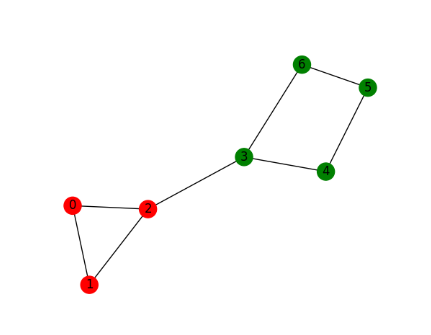
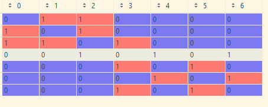
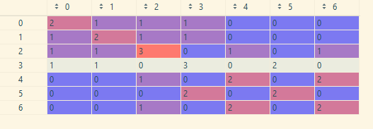
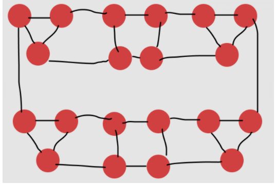
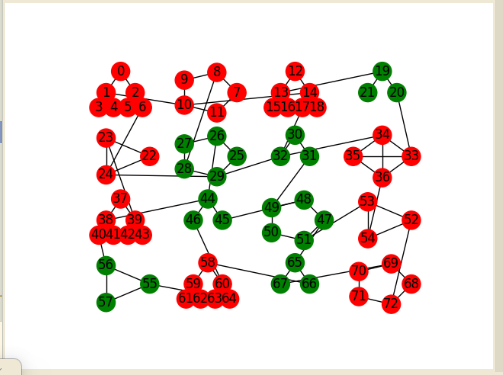
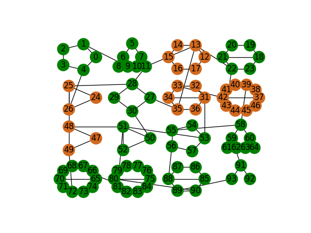
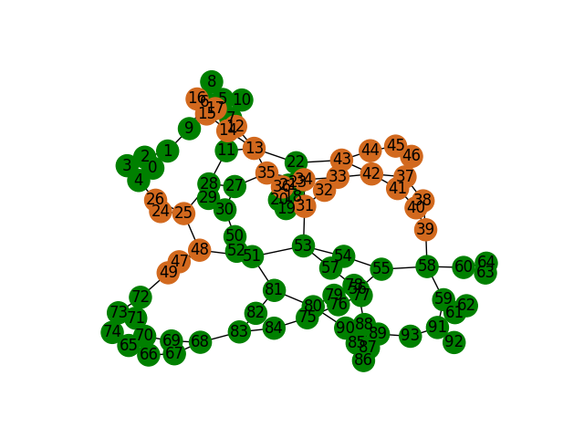
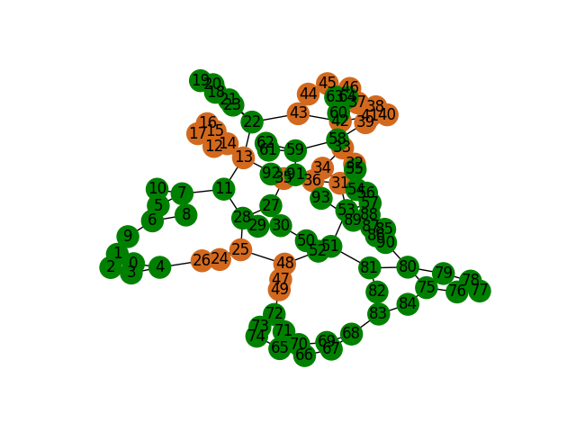

## Content attention: unit testing with and without distance:

* training acc usually starts at about 0.5 and reaches 0.61 after 7-8 epochs.  
  Increasing or decreasing embedding dim does not change that(unless decreasing to like 3, which hurts acc)  
  Does not seem to be able to overfit a small dataset, but this may be reasonable, as the transformer only looks at x(
  random 3 dim vector) and the whole graph, so good memorization is impossible(the same graph can have 2 nodes with same
  x features but different labels, and the model cannot memorize, as it sees only the complete graph and not the node's
  enviourments)
* Expected acc **without distance** on **real data, i.e test acc** should be 0.5, as shown in "A generalization of
  transformers to graph"
* **Gradeitns seem to be small**

Next actions:
So content attention tests does not immidiatliy tell there is a probelm with learning or the model. I should, for now,
disable the pure content overfit test.

Now I should check the distance content attention. It should give better results then only content. Here I should be
able to overfit if I am using a stack of only [0,1] as it is as expressive as gin

So my steps will be

0) fix init of AdjStackAttentionWeights.. should not receive use_distance_bias..!

1) create a test for only position attention with use_distance .. ! that assign a large negative bias and equal positive
   weights.   
   That should simulate regular gin, by setting bias to -inf 1.1) create a method for mocking the attention bias weights

2) create a way to freeze the learning of the positional attention weights

## 6/3

### todo:

-why are there zeros in new_adj?? in sigmoid, doing unreachable bias = -inf or -inf will work I think

-VERIFY PROPER MASKING IN SOFTMAX TOO(fix_nans function)!!
-maybe -1000 is causing trouble for the gradient and I should just let it be..? -try norm first

- try single layer(if achives above 0.6, stick with it for debugging)
  -look at gin architecture in more detail(batch norms relu etc)

y = \frac{x - \mathrm{E}[x]}{\sqrt{\mathrm{Var}[x] + \epsilon}} * \gamma + \beta y = \frac{x - \mathrm{E}[x]
}{\sqrt{\mathrm{Var}[x] + \epsilon}} * \gamma + \beta

might be the batch norms

norm first is probabliy better

### done:

-mock as relu: about the same thing happens -work also with jk=last

- emb_dim =1 does not learn -gnn increases slowly but surly -see unreachable bias is added to unreablcle really... and
  so init to -1 or -10. not +1. -vverify that not mocking unreachable to a negative number leads to worse performance
- see what happens when I do not init weights and bias to my defaults, but just normally: works just as well -mock
  feedforward to eye

### problem with using gating(sigmoid) - gradients exploding at some point

single layer
position+distance :https://www.comet.ml/danielglickmantau/test/2d87d20ab4c64d5aa5d72b6a9d52cdba?experiment-tab=chart&search=grad_norm&showOutliers=true&smoothing=0&transformY=smoothing&xAxis=step
looks like the gradients are starting small, and on some epoch, ~70 they rapdily increase  
it causes the predictions to change very fast(e,.g)
Evaluating epoch 79...acc: {'acc_0': 0.9931260229132569, 'acc_1': 0.2013888888888889, 'acc': 0.5972574559010729}
Evaluating epoch 80...acc: {'acc_0': 0.7080196399345335, 'acc_1': 0.890625, 'acc': 0.7993223199672668} Evaluating epoch
81...acc: {'acc_0': 0.3656301145662848, 'acc_1': 0.9861111111111112, 'acc': 0.675870612838698}

maybe batch norm will fix it................

## Patten - number of neigbours distrubtion

(1/stacks[real_nodes_edge_mask][stacks[real_nodes_edge_mask].sum(dim=-1) > 0].sum(dim=-1)).unique(
return_counts=True,sorted=True)

tensor([ 1.0000, 24.0000, 25.0000, 26.0000, 27.0000, 28.0000, 29.0000, 30.0000, 31.0000, 32.0000, 33.0000, 34.0000, 35.0000, 36.0000, 37.0000, 38.0000, 39.0000, 40.0000, 41.0000, 42.0000, 43.0000, 44.0000, 45.0000, 46.0000, 47.0000, 48.0000, 49.0000, 50.0000, 51.0000, 52.0000, 53.0000, 54.0000, 55.0000, 56.0000, 57.0000, 58.0000, 59.0000, 60.0000, 61.0000, 62.0000, 63.0000, 64.0000, 65.0000, 66.0000, 67.0000, 68.0000, 69.0000, 70.0000, 71.0000, 72.0000, 73.0000, 74.0000, 75.0000, 76.0000, 77.0000, 78.0000, 79.0000, 81.0000, 82.0000])

torch.Size([59])
tensor([3631, 72, 75, 104, 189, 252, 435, 450, 744, 992, 1089, 1496, 2660, 2700, 3922, 3686, 4134, 4960, 5330, 6258, 5633, 6908, 7605, 7406, 7332, 7392, 9114, 8000, 7497, 7020, 6731, 6372, 4950, 5656, 4446, 3828, 3835, 3840, 2867, 3162, 2142, 1792, 2145, 1122, 1675, 1224, 1173, 420, 426, 360, 219, 370, 150, 304, 385, 312, 158, 81, 164])

### Should gating work in theory as good as gnn?

using adj_stack = [0,1] , setting unreachable_bias to -inf

### Making gating work

When running overfitting test, looks like the acc does improve. But closer than gnn..

----

## 8.3

### Effects of batch norm

In Gnn, having batch norm before the relu is paramount. Indeed variance seems very high in that intermediate layer.

* Tried running gnn without batch norm in between layer to see if that what may cause the problem in my model... Gnn is
  still working fine.. good performance, stable accuracy which raises linearly
  https://www.comet.ml/danielglickmantau/test/480df44051ba45479c8082e11d63377c?experiment-tab=chart&showOutliers=true&smoothing=0&transformY=smoothing&xAxis=step

* Tried also disabling batch norm in GNN's MLP(and also in between) - now model gets 50%!!
  https://www.comet.ml/danielglickmantau/test/96367b1099bc4109b11255b5e58e2b79?experiment-tab=chart&showOutliers=true&smoothing=0&transformY=smoothing&xAxis=step

only mlp batch norm disabled and batch norm between gnn enabled
https://www.comet.ml/danielglickmantau/test/5e260c893fa7426fb6f5b189bbd5b64f

batch norm in mlp enabled and disabled between layers working!!
https://www.comet.ml/danielglickmantau/test/69ab0eb4723d4aba881be86202d993c5

### Debugging networks by observing gradients

The grad/weight rule does seem reasonable. With a working gnn
training(https://www.comet.ml/danielglickmantau/test/69ab0eb4723d4aba881be86202d993c5?experiment-tab=chart&search=grad%2Fweight&showOutliers=true&smoothing=0&transformY=smoothing&xAxis=step)
the ratio decreases niclely and is in the ballpark of 0.1-0.001

With non
working https://www.comet.ml/danielglickmantau/test/5e260c893fa7426fb6f5b189bbd5b64f?experiment-tab=chart&search=grad%2Fweight&showOutliers=true&smoothing=0&transformY=smoothing&xAxis=step
you can see the ratio of mlp.bias changes(goes up and down) and it is always very low..

### 9.3

Debugge hit the wall(in git stash).. we can see, in the case of line graph. that polyndrome edges are indeed unique(and
symetric)

* verfied self attention does not change "padding" nodes, even when they are not zero(later layers)

* running gnn with sigmoid on eps( (1 + torch.sigmoid(self.eps) ) * x)
  increases lineary and reaches good performance > 0.84

with a single position attention gating layer , trainign is stable and increases nicly up to 0.7

with 2 layers problems already start to araise.. nice

softmax grad_output shape 32,142,142 zero for zero nodes.. not zeros else where

    grad_input: no zeros

____

### 10.3

Want reaL_nodes_edge_mask to contain only entries for which stacks.sum(dim=-1) != 0 verfied stacks all zeros entries
masks more than mask True == all(map(lambda tup: not tup[0] or (tup[0] and tup[1]), list(zip(stacks.sum(dim=-1) != 0,
real_nodes_edge_mask))))

ratio of edges types: p[neiougbour y | self y]
{key: value[:,1].sum() / (edges[(key[0],1-key[1])][:,1].sum()   + value[:,1].sum()  ) for key,value in edges.items() }
(0, 0) = {Tensor} torch.Size([]) tensor(0.7970)
(0, 1) = {Tensor} torch.Size([]) tensor(0.2030)
(1, 0) = {Tensor} torch.Size([]) tensor(0.8416)
(1, 1) = {Tensor} torch.Size([]) tensor(0.1584)

p[connect | (y_neigbour,y_self) = {key: value[:,1].sum() / ( len( edges[(key[0],1-key[1])]  ) + len(value)  ) for
key,value in edges.items() }
(0, 0) = {Tensor} torch.Size([]) tensor(0.0074)
(0, 1) = {Tensor} torch.Size([]) tensor(0.0019)
(1, 0) = {Tensor} torch.Size([]) tensor(0.0078)
(1, 1) = {Tensor} torch.Size([]) tensor(0.0015)

### 13/3

* positional gating is much faster than gin somehow

### Comparing modified gin with positonal gating with use_distance

### Architecture

modfied gin( use sigmoid on wights)
gin layer:
x_mid = (1 + sigmoid(self.eps)) * x + sigmoid(self.eps2) * relu(neigbours) )
out = x_mid -> linear -> batch norm -> relu -> linear out = batch_norm(out)
out = x + relu(out)

positional gating norm first and use_distance with adj_stack=[0,1]:
x_mid = gating( norm1(x) )
gating: sigmoid(w1) * x + sigmoid(w2) * neigbours x_mid = x + x_mid out = x_mid -> norm2 -> linear -> relu -> linear out
= x_mid + out

possible things that can cause gin to learn and positional to not learn:
(1 + sigmoid(eps))  removing it still gives almost same
results   https://www.comet.ml/danielglickmantau/test/ce88b397e3e843379fa667ab438c8eb1?experiment-tab=chart&showOutliers=true&smoothing=0&transformY=smoothing&xAxis=step
relu(neigbours)    removing it still gives good results,
0.846    https://www.comet.ml/danielglickmantau/test/4029891ad91a43acb4ba8042aa41a291?experiment-tab=chart&showOutliers=true&smoothing=0&transformY=smoothing&xAxis=step
removing
both:https://www.comet.ml/danielglickmantau/test/578e362837554878844204b5e2e8565a?experiment-tab=chart&search=score&showOutliers=true&smoothing=0&transformY=smoothing&xAxis=step

### Unstable gradients:

Training single layer position attention(
+distance): https://www.comet.ml/danielglickmantau/test/074867d9e5bf4aaba9db7a291c4edc33?experiment-tab=chart&search=grad%2Fweight&showOutliers=true&smoothing=0&transformY=smoothing&xAxis=step
seems stable. only norm2 is somewhat unstable.

2 layers position attention with distance:
more unstable but reasonable.. once again norm2 seems like the culpritiuyi

masking in second norm does not seem to effect.. masking layer norm does not seem to effect now..

4 layers no layer norm at all: low score(0.5) and goes up and
downww https://www.comet.ml/danielglickmantau/test/5553a00927ad4ee0ba2c02290e029e0e?experiment-tab=chart&showOutliers=true&smoothing=0&transformY=smoothing&xAxis=step
4 layers.. no layer norm masking and small learning
rate: https://www.comet.ml/danielglickmantau/test/312b94fbdfb04ef180dacbc924135a1b
4 layers.. no layer norm masking and large learning rate:
probably https://www.comet.ml/danielglickmantau/test/2c50c4c894c14c3a87dcbce2134caefe
4 layers layer norm masking and large learning
rate: https://www.comet.ml/danielglickmantau/test/6ece693e5bc349ed8570902e13eb5ba6?experiment-tab=chart&search=score&showOutliers=true&smoothing=0&transformY=smoothing&xAxis=step
4 layers layer norm masking and small learning
rate https://www.comet.ml/danielglickmantau/test/8f68e70672d749348b05d5714778ff81?experiment-tab=stdout

no distance:
4 layers.. 1e-4 learning rate.. score jumps up and down masked
norm https://www.comet.ml/danielglickmantau/test/780c26fb02b245ddbb5e7c9d702fb2bf?experiment-tab=chart&showOutliers=true&smoothing=0&transformY=smoothing&xAxis=step
4 layers 1e-5 learning rate small jumps up and down but generally goes up.. very
slowly.. https://www.comet.ml/danielglickmantau/test/6bdc5cf6d313442e963efb9a2f85a6d9?experiment-tab=chart&showOutliers=true&smoothing=0&transformY=smoothing&xAxis=step
4 layers 1e-5 learning rate and no masking in
norm https://www.comet.ml/danielglickmantau/test/93ab8630c69f406f842cded506370dcc

learning rate seems to have the real effect.. masking in norm nop

batch norms:
attention batch https://www.comet.ml/danielglickmantau/test/f5f67994ad554e34936b1213d032f40b
ff batch norm: https://www.comet.ml/danielglickmantau/test/6b0c579ab68b4473b5b37e5ea0aa17a6
both batch norm: https://www.comet.ml/danielglickmantau/test/268bd590e6ab4ec38ed5ac6e08a0355d
batch norm added only in transformer MLP(after first linear) WORKS OVER
0.9!! https://www.comet.ml/danielglickmantau/test/96e6be36c88a405ab9c052b822d4e7ec?experiment-tab=chart&search=score&showOutliers=true&smoothing=0&transformY=smoothing&xAxis=step

bug receptive field(

8) https://www.comet.ml/danielglickmantau/test/b7aa42dbc713447a876c3680e3d4491c?experiment-tab=chart&search=score&showOutliers=true&smoothing=0&transformY=smoothing&xAxis=step

### 14.3

Gating with larger adj_stack=[0,1,2,3,4]

Attention(no gating) with batch norm in MLP, seems to work on pattern... it seems mandatory for larger adj stacj seems
even better..
https://www.comet.ml/danielglickmantau/position-attention-mlp-batch-norm/view/new/experiments

with gating maybe batch norm helps larger receptive field I dont know...
https://www.comet.ml/danielglickmantau/gin-pattern/view/new/experiments

### 15.3

attention with batch norm sota on
pattern https://www.comet.ml/danielglickmantau/position-attention-mlp-batch-norm/view/new/experiments
adj_stack=[0,1,2,3,4] is better than [0,1]
learning rate does not effect.. higher lr is better if anything

Seems like it is not the learning rate and not the batch norm. it is the masking results pattern gating 4
layers https://www.comet.ml/danielglickmantau/gin-pattern/view/YjK8ZWP0KIBaQK2I0qAUzLaHa/experiments:
note that things may improve as it is still running MLP-BN:False Attention norm:batch FF norm:batch 0.839 MLP-BN:False
Attention norm:batch FF norm:layer 0.852 MLP-BN:False Attention norm:layer FF norm:batch
0.856 https://www.comet.ml/danielglickmantau/gin-pattern/e92451205a7a46b1b8005a1949cb02ef
MLP-BN:False Attention norm:layer FF norm:layer
0.835 https://www.comet.ml/danielglickmantau/gin-pattern/2048382a6d84477094677ad4891f89ed

MLP-BN:True Attention norm:batch FF norm:batch
0.837 https://www.comet.ml/danielglickmantau/gin-pattern/fe9c8e46f02e453f8305bcf9d472d57b
MLP-BN:True Attention norm:batch FF norm:layer
0.839 https://www.comet.ml/danielglickmantau/gin-pattern/cdedfc02c77e4d2d9539d336c76b762d
MLP-BN:True Attention norm:layer FF norm:batch
0.851 https://www.comet.ml/danielglickmantau/gin-pattern/53bb1888a82c422b96e8e84fb211b9bb
MLP-BN:True Attention norm:layer FF norm:layer 0.835

### 24.3

debugging polyndrome example. I am expecting that if I give oppsite weights(+1,-1) to my heads. multuplying the 2 heads
will yield maximum results in opposing(symetric) nodes

This is not the case. Q1: does multiplying heads make sense? yes each head h, h[i,j] gives a feature to the edge(i,j).
each row h[i,:] gives a feature vector for i, which shows its compatibility with the rest of the nodes

Q2: do I need to transpose the second head? Lets assume both heads are the same, h1=h2. I want h1h2[i,i] to contain the
dot product of h1[i] and h2[i]
so YES, I need to transpose h2

Q3: why is (h1@h2.T)[1,2] < (h1@h2.T)[1,3], if 1,2 are opposite in the polnydrome? h1[1] [0.875, 1.75, 1.125, 0.25]
h2[2] [-0.25, -1.125, -1.75, -0.875]
h2[3] [-0.25, -0.5, -1.75, -1.5]

I want product of opposining node heads to be maximal.. Lets look at the stacks. We have that stacks.permute(
1,2,0)[1][2] == stacks.permute(1,2,0)[2][1]. The edge (1,2) is same as (2,1) They are symetric.

works:
(stacks.permute(1,2,0).reshape(4,-1)@-stacks.permute(1,2,0).reshape(4,-1).T).detach().numpy()
no casting to heads...

so it works when I reverse feature individually, but not when I sum.. consider that.. needs to be fixed but move on for
now

We can expect the dot product to be maximal? gusses: batch normalize feature(original stack)... if i do 2x1 or 3x1
convlustion, I need to

issue:

stacks[1][2] = torch.Size([5]) tensor([0.0000, 0.5000, 0.0000, 0.6250, 0.0000])

I am multiplying the edges of each graph

### 11/4

with pyramid graph min size=1 max size=5. and num_stacks=3 I get 23 unique edges.. and only zero edge are ambigoious.

### 12/4

------------  ---------------  ------------  ------------------  --------------------------
wrong table
------------  ---------------  ------------  ------------------  --------------------------

00078 = {tuple: 3} ((0.0, 0.0, 0.0, 0.015625, 0.012442131), (0.0, 0.0, 0.0, 0.01388889, 0.014467594),
7.11658106627034e-06)
00079 = {tuple: 3} ((0.0, 0.0, 0.0, 0.015625, 0.012442131), (0.0, 0.0, 0.0, 0.01388889, 0.014467595),
7.116584838991191e-06)
00080 = {tuple: 3} ((0.0, 0.0, 0.0, 0.0, 0.006365741), (0.0, 0.0, 0.0, 0.0, 0.0034722227), 8.37244886806905e-06)

size 10:
(4,2) to (7,5) : torch.Size([5]) tensor([0.0000, 0.0000, 0.0000, 0.0046, 0.009  3])
(4,2) to (7,4)      torch.Size([5]) tensor([0.0000, 0.0000, 0.0000, 0.0139, 0.0123])

(8,7) to (9,9) [0.0, 0.0, 0.0833333358168602, 0.0416666679084301, 0.05844907835125923]
(8,7) to (6,6) [0.0, 0.0, 0.0694444477558136, 0.033564817160367966, 0.04976852238178253]

##

### 13/4

### Complexity of 3 coloring using transformer+edge bias vs simple og transformer

Main difference concepptually, if og transformer learns how to re distributae the weights with a deep network, while
transformer+edge collpases after every averaging

e = dim edge ; d = dim x  
edge params: assuming passing through ffn:  8e^2 ...=( e*4e + e*4e)
complexity: (nxn)*(8e^2)
edge bias: e->2 params: e*2 MHA params: d^2 * 4 ... (4 for wq,wk,wv,wo)
complexity: 3*(nxd) + (n^2)d ... (q*qk, k*wk, v*wo + (kq)*v)
FFN:
params: 8d^2 complexity n * 8d^2

Edge bias transformer parameters:
edge * l + L * transformer = 8e^2 * l + L( (4*d^2) + 8*d^2)
q,k,w,o L means num layers l means 1 or L, depending what we choose

simple og transformer:
edge ffn: e -> e edge bias:e-> 2: wq, wk: e-> 1.. need 2 weights to break transetivity

each layer:
e = ffn(e)
(e@wq)@ (e@wk) .. not sure if I want softmax here in hidden layers.. other options are relu and gaussian normnization

params:
ffn: 8*e^2 wq,wk: 2e

path attention:
(E @ wk) @ (E @ wk )

cluster attention:
(E@ wk) @ (E.T @ wk)

### 18/4

cora link labels:torch.Size([17952]) tensor([1., 1., 1., ..., 0., 0., 0.])

classifiyin pyramid of size 5.. num_adj_stack=5 gets stuck at 0.733 acc classifiyin pyramid of size 5.. num_adj_stack=6
gets stuck at 0.733 acc

with ffn-2d and learning rate 4e-3 gets about 0.82 but unstable adding batch-norm in between layers.. 0.853 adding relu:
gets 0.92

with ffn-4d bn+relu lr 1e-4 still 0.92

### 19/4

pyramid base sizs 3. num_stack = 2 max accuracy is 0.833 because there are ambigious edges( 0,0 edge)

increasing num_stack to 3:

edges are not symatrix.. e.g with pyramid size =3
(1,0) -> (2,2) edge is [0,0,0.1250]
(2,2) -> (1,0) edge is [0,0,0.25]

there are still ambigious edges e.g
(2,1) -> (0,0) is [0,0,0.125]
and also (2,2) -> (0,0)

there is a special issue with pyramid size 3, that there are ambigous edges
------------  --------------  ------------  ------------------  --------------------------
pyramid base num adj stacks unique edges of which ambiguous % pairs in receptive field 3 2 4 0 0.6666666666666667 3 3 8
1 1.0 3 4 8 1 1.0 3 5 8 1 1.0 4 3 15 0 0.8200000000000001 4 4 23 0 1.0 4 5 40 0 1.0 4 6 53 0 1.0 5 4 48 0
0.8933333333333333 5 5 85 0 1.0 5 6 114 0 1.0 5 7 154 0 1.0 6 5 134 0 0.9319727891156463 6 6 195 0 1.0 6 7 265 0 1.0 6 8
338 0 1.0 7 6 299 0 0.9540816326530612 7 7 446 0 1.0 7 8 580 0 1.0 7 9 670 0 1.0 8 7 694 0 0.9675925925925926 8 8 925 0
1.0 8 9 1092 0 1.0 8 10 1180 0 1.0 9 8 1325 0 0.9762962962962963 9 9 1609 0 1.0 9 10 1775 0 1.0 9 11 1887 0 1.0
------------  --------------  ------------  ------------------  --------------------------

-----------  --------------  ------------  ------------------  --------------------------
pyramid base num adj stacks unique edges of which ambiguous % pairs in receptive field
5 5 85 0 1.0
6 6 195 0 1.0
7 7 446 0 1.0
8 8 925 0 1.0
9 9 1609 0 1.0
10 10 2530 0 1.0
11 11 3758 0 1.0
12 12 5496 0 1.0
13 13 7706 0 1.0
14 14 10406 0 1.0
15 15 13848 0 1.0
16 16 17866 0 1.0
------------  --------------  ------------  ------------------  --------------------------

situation:
with pyramid size 4 and adj_stack 4. cannot get 100% acuuracy. getting 0.97.. cannot distringuish [0,0,0.833,0.0417]

1) make sure edge is only labeled as True yes..
2) watch what is the closest edges to it logit ****closest: edge is [0,0,0.0625,0.0365] edege between (2,0)->( 0,0),  (
   1,0)
   ->(3,0), (3,1)->(3,3)

euclidian closest:[0,0,0,0.0312] and then [0,0,0,0.0365] which are both True(same color edge)
after that there is [0,0,0.0417,0.0729] which is false(different color edge)

converages to 1 acc:
edge dim = 14; hidden = edge_dim*2 -> about 3k epochs
edge_dim = 5; hidden = 10*edge_dim -> about 3.8k epochs

without batch norm:gets stuck,,, at 0.82

------------  ---------  ----------------------  -----  -------  ---------  -------------------  ------------------  ----------------  -------------------  ------------------  -------------------
pyramid base edge size hidden layer multipler bn #params final acc final FP epochs to converge acc at epoch 500 FP at
epoch 500 acc at 2k FP at 2k
4 4 2 True 65 0.97 0.0 13569 0.85 0.06 0.85 0.06
4 4 2 False 49 0.82 0.12 11201 0.76 0.0 0.76 0.0
4 4 4 True 129 0.97 0.0 12657 0.76 0.0 0.88 0.06
4 4 4 False 97 0.82 0.12 10868 0.76 0.0 0.76 0.0
4 4 8 True 257 0.97 0.0 12746 0.88 0.06 0.85 0.06
4 4 8 False 193 0.82 0.12 10246 0.75 0.0 0.79 0.0
4 5 2 True 91 0.97 0.0 12902 0.79 0.0 0.85 0.06
4 5 2 False 71 0.82 0.12 11429 0.76 0.0 0.79 0.0
4 5 4 True 181 1.0 0.0 5000 0.85 0.06 0.88 0.06
4 5 4 False 141 0.82 0.12 10795 0.76 0.0 0.79 0.0
4 5 8 True 361 1.0 0.0 4392 0.85 0.06 0.91 0.06
4 5 8 False 281 0.82 0.12 10121 0.76 0.0 0.79 0.0
4 6 2 True 121 0.97 0.0 12654 0.76 0.0 0.88 0.06
4 6 2 False 97 0.82 0.12 11212 0.76 0.0 0.76 0.0
4 6 4 True 241 1.0 0.0 5195 0.85 0.06 0.85 0.06
4 6 4 False 193 0.82 0.12 9707 0.76 0.0 0.79 0.0
4 6 8 True 481 1.0 0.0 4727 0.85 0.06 0.85 0.06
4 6 8 False 385 0.88 0.06 9344 0.76 0.0 0.73 0.06
5 5 2 True 91 0.92 0.02666666666666667 23970 0.84 0.05333333333333334 0.8533333333333334 0.05333333333333334
------------  ---------  ----------------------  -----  -------  ---------  -------------------  ------------------  ----------------  -------------------  ------------------  -------------------

should use batch norm in hidden layer!!!

------------------  -----------------  ---------  ----------------------  ----  -------  ------------------  --------------------  ------------------  --------------------  ------------------  ------------------  ------------------
pyramid base train pyramid base test edge size hidden layer-X bn #params final acc final FP best acc best fp epochs to
converge acc at epoch 500 acc at 2k
4 5 4 2 True 65 0.8 0.0266 0.8133 0.0266 2265 0.800 0.8
4 5 4 4 True 129 0.733 0.1866 0.8266 0.0266 2669 0.800 0.8133333333333334
4 5 5 2 True 91 0.773 0.0266 0.8533 0.0266 2191 0.813 0.7733333333333333
4 5 5 4 True 181 0.813 0.0266 0.8266 0.0266 2615 0.800 0.8266666666666667
4 5 6 2 True 121 0.706 0.1333 0.8533 0.0266 3316 0.813 0.8266666666666667
4 5 6 4 True 241 0.706 0.1866 0.8400 0.0266 3114 0.800 0.733333333

5 6 5 2 True 91 0.836 0.0408 0.8639 0.0408 5572 0.795 0.7755102040816326
5 6 5 4 True 181 0.795 0.0408 0.8435 0.0272 3558 0.768 0.782312925170068
5 6 6 2 True 121 0.768 0.0544 0.8163 0.0136 3103 0.809 0.7687074829931972
5 6 6 4 True 241 0.789 0.1088 0.8639 0.0272 5336 0.789 0.782312925170068
5 6 7 2 True 155 0.823 0.0408 0.8367 0.0272 4496 0.789 0.7687074829931972
5 6 7 4 True 309 0.748 0.0680 0.8639 0.0272 7658 0.795 0.761904761

6 7 6 2 True 121 0.854 0.0306 0.88520 0.0229 9681 0.774 0.8354591836734694
6 7 6 4 True 241 0.797 0.0382 0.8278 0.0153 4201 0.778 0.8086734693877551
6 7 7 2 True 155 0.839 0.0382 0.8584 0.0306 7425 0.770 0.7665816326530612
6 7 7 4 True 309 0.835 0.0382 0.8928 0.0153 8073 0.785 0.8010204081632653
6 7 8 2 True 193 0.820 0.0535 0.8698 0.0459 7141 0.785 0.8239795918367347
6 7 8 4 True 385 0.732 0.2525 0.9043 0.0153 11023 0.781 0.7895408163265306
------------------  -----------------  ---------  ----------------------  ----  -------  ------------------  --------------------  ------------------  --------------------  ------------------  ------------------  ------------------

##21/4
------------------  -----------------  ---------  ----------------------  -----  --------  -----------------------  ---------  -------  ------------------  -------------------  ------------------  ------------------  -------------------  ------------------  -------------------  ------------------
pyramid base train pyramid base test edge size hidden layer multipler bn just sum network_then_projection normalize
#params final acc final FP final_acc_train best acc best fp epochs to converge acc at epoch 500 acc at 2k
5 5 5 2 True True True 195 0.36 0.6133333333333333 0.8088888888888889 0.8533333333333334 0.05333333333333334 2387
0.8266666666666667 0.6533333333333333
5 5 5 2 True True True layer 205 0.44 0.56 0.7555555555555555 0.8533333333333334 0.08 3643 0.7066666666666667
0.5333333333333333
5 5 5 2 True True True l2 195 0.8 0.13333333333333333 0.8044444444444444 0.8666666666666667 0.08 3328 0.7466666666666667
0.6533333333333333
5 5 5 2 True True False 80 0.8133333333333334 0.08 0.7866666666666666 0.8133333333333334 0.08 2942 0.68
0.8133333333333334
5 5 5 2 True True False layer 90 0.84 0.10666666666666667 0.8 0.84 0.10666666666666667 2893 0.6266666666666667 0.84
5 5 5 2 True True False l2 80 0.8133333333333334 0.08 0.8 0.8133333333333334 0.08 3059 0.6 0.8133333333333334
5 5 5 2 True False True 206 0.9466666666666667 0.0 0.9288888888888889 0.9466666666666667 0.0 3804 0.8533333333333334
0.92
5 5 5 2 True False True layer 216 0.8266666666666667 0.05333333333333334 0.8355555555555556 0.8533333333333334
0.02666666666666667 2254 0.8266666666666667 0.8266666666666667
5 5 5 2 True False True l2 206 0.92 0.02666666666666667 0.8755555555555555 0.92 0.02666666666666667 3879
0.8133333333333334 0.8933333333333333
5 5 5 2 True False False 91 0.8266666666666667 0.05333333333333334 0.84 0.8533333333333334 0.02666666666666667 2323
0.8533333333333334 0.8266666666666667
5 5 5 2 True False False layer 101 0.84 0.08 0.8488888888888889 0.84 0.08 2931 0.8133333333333334 0.84
5 5 5 2 True False False l2 91 0.84 0.08 0.8266666666666667 0.84 0.08 3375 0.8133333333333334 0.84
5 5 5 2 False True True 175 0.8133333333333334 0.08 0.8133333333333334 0.8133333333333334 0.08 4020 0.6133333333333333
0.7866666666666666
5 5 5 2 False True True layer 185 0.76 0.02666666666666667 0.68 0.76 0.02666666666666667 2114 0.7333333333333333 0.68
5 5 5 2 False True True l2 175 0.8933333333333333 0.02666666666666667 0.8711111111111111 0.92 0.0 4584
0.7866666666666666 0.88
5 5 5 2 False True False 60 0.76 0.18666666666666668 0.6933333333333334 0.8133333333333334 0.13333333333333333 5689
0.5466666666666666 0.7333333333333333
5 5 5 2 False True False layer 70 0.8133333333333334 0.13333333333333333 0.7822222222222223 0.84 0.10666666666666667
3869 0.7066666666666667 0.8133333333333334
5 5 5 2 False True False l2 60 0.7866666666666666 0.10666666666666667 0.7866666666666666 0.8133333333333334 0.08 3849
0.7333333333333333 0.7866666666666666
5 5 5 2 False False True 186 0.8133333333333334 0.08 0.8133333333333334 0.8533333333333334 0.02666666666666667 2539
0.8266666666666667 0.8133333333333334
5 5 5 2 False False True layer 196 0.8266666666666667 0.05333333333333334 0.8266666666666667 0.84 0.05333333333333334
2177 0.8266666666666667 0.8266666666666667
5 5 5 2 False False True l2 186 0.8266666666666667 0.05333333333333334 0.8266666666666667 0.8533333333333334
0.02666666666666667 2285 0.8266666666666667 0.8266666666666667
5 5 5 2 False False False 71 0.8 0.08 0.8 0.8533333333333334 0.02666666666666667 4955 0.7333333333333333 0.72
5 5 5 2 False False False layer 81 0.84 0.08 0.84 0.84 0.08 3148 0.8133333333333334 0.84
5 5 5 2 False False False l2 71 0.8133333333333334 0.08 0.8133333333333334 0.8133333333333334 0.08 2711
0.7333333333333333 0.8133333333333334
5 5 5 4 True True True 385 0.76 0.13333333333333333 0.8 0.88 0.05333333333333334 3412 0.8 0.36
5 5 5 4 True True True layer 395 0.8933333333333333 0.02666666666666667 0.8577777777777778 0.8933333333333333
0.02666666666666667 5018 0.7733333333333333 0.64
5 5 5 4 True True True l2 385 0.7866666666666666 0.13333333333333333 0.8711111111111111 0.92 0.0 3725 0.3333333333333333
0.4666666666666667
5 5 5 4 True True False 160 0.8133333333333334 0.08 0.8 0.8133333333333334 0.08 2808 0.7733333333333333
0.7866666666666666
5 5 5 4 True True False layer 170 0.84 0.10666666666666667 0.8177777777777778 0.84 0.10666666666666667 2960
0.41333333333333333 0.84
5 5 5 4 True True False l2 160 0.8133333333333334 0.08 0.7955555555555556 0.8133333333333334 0.08 2923
0.5466666666666666 0.8133333333333334
5 5 5 4 True False True 406 0.8933333333333333 0.05333333333333334 0.9155555555555556 0.92 0.02666666666666667 3453
0.8133333333333334 0.92
5 5 5 4 True False True layer 416 0.92 0.02666666666666667 0.8977777777777778 0.92 0.02666666666666667 2888
0.8266666666666667 0.8933333333333333
5 5 5 4 True False True l2 406 0.96 0.0 0.96 0.96 0.0 5909 0.8133333333333334 0.84
5 5 5 4 True False False 181 0.92 0.02666666666666667 0.9022222222222223 0.92 0.02666666666666667 4435
0.8266666666666667 0.84
5 5 5 4 True False False layer 191 0.84 0.08 0.8488888888888889 0.84 0.08 2755 0.8133333333333334 0.84
5 5 5 4 True False False l2 181 0.84 0.08 0.84 0.84 0.08 2471 0.84 0.84
5 5 5 4 False True True 345 0.8133333333333334 0.08 0.8133333333333334 0.8133333333333334 0.08 4273 0.7066666666666667
0.7866666666666666
5 5 5 4 False True True layer 355 0.88 0.0 0.88 0.92 0.0 5334 0.76 0.72
5 5 5 4 False True True l2 345 0.96 0.0 0.9511111111111111 0.96 0.0 5730 0.7333333333333333 0.84
5 5 5 4 False True False 120 0.7333333333333333 0.21333333333333335 0.76 0.8133333333333334 0.13333333333333333 4901 0.6
0.7066666666666667
5 5 5 4 False True False layer 130 0.84 0.10666666666666667 0.7733333333333333 0.84 0.10666666666666667 4470 0.68 0.8
5 5 5 4 False True False l2 120 0.7866666666666666 0.10666666666666667 0.7866666666666666 0.8133333333333334 0.08 4193
0.6533333333333333 0.7333333333333333
5 5 5 4 False False True 366 0.8133333333333334 0.08 0.8133333333333334 0.8533333333333334 0.02666666666666667 2507
0.8266666666666667 0.8133333333333334
5 5 5 4 False False True layer 376 0.8533333333333334 0.02666666666666667 0.8533333333333334 0.8533333333333334
0.02666666666666667 2407 0.8266666666666667 0.8533333333333334
5 5 5 4 False False True l2 366 0.96 0.0 0.96 0.96 0.0 9497 0.8533333333333334 0.8666666666666667
5 5 5 4 False False False 141 0.8 0.08 0.8 0.8533333333333334 0.02666666666666667 4452 0.7333333333333333 0.8
5 5 5 4 False False False layer 151 0.8133333333333334 0.08 0.8133333333333334 0.8133333333333334 0.08 2157
0.8133333333333334 0.8133333333333334
5 5 5 4 False False False l2 141 0.8133333333333334 0.08 0.8133333333333334 0.8133333333333334 0.08 2681 0.68
0.8133333333333334
5 5 6 2 True True True 270 0.5466666666666666 0.4 0.8444444444444444 0.92 0.0 3754 0.7466666666666667 0.6933333333333334
5 5 6 2 True True True layer 282 0.7333333333333333 0.18666666666666668 0.8133333333333334 0.92 0.0 4326
0.7066666666666667 0.6
5 5 6 2 True True True l2 270 0.5733333333333334 0.37333333333333335 0.8533333333333334 0.9466666666666667 0.0 4468
0.7733333333333333 0.7066666666666667
5 5 6 2 True True False 108 0.8266666666666667 0.08 0.8177777777777778 0.8533333333333334 0.05333333333333334 4498 0.68
0.7866666666666666
5 5 6 2 True True False layer 120 0.8666666666666667 0.08 0.7511111111111111 0.8666666666666667 0.08 2788
0.5466666666666666 0.8666666666666667
5 5 6 2 True True False l2 108 0.84 0.10666666666666667 0.8222222222222222 0.8666666666666667 0.08 2855
0.5733333333333334 0.8666666666666667
5 5 6 2 True False True 283 0.92 0.02666666666666667 0.8711111111111111 0.92 0.02666666666666667 2905 0.8533333333333334
0.92
5 5 6 2 True False True layer 295 0.7866666666666666 0.10666666666666667 0.9866666666666667 1.0 0.0 8425
0.8133333333333334 0.88
5 5 6 2 True False True l2 283 0.9733333333333334 0.0 0.9733333333333334 1.0 0.0 5445 0.8533333333333334
0.9466666666666667
5 5 6 2 True False False 121 0.8666666666666667 0.05333333333333334 0.8844444444444445 0.8933333333333333
0.02666666666666667 3419 0.8533333333333334 0.84
5 5 6 2 True False False layer 133 1.0 0.0 0.9555555555555556 1.0 0.0 2901 0.8666666666666667 0.8666666666666667
5 5 6 2 True False False l2 121 1.0 0.0 0.9688888888888889 1.0 0.0 4142 0.8133333333333334 0.8666666666666667
5 5 6 2 False True True 246 0.84 0.05333333333333334 0.84 0.84 0.05333333333333334 5156 0.6533333333333333
0.8133333333333334
5 5 6 2 False True True layer 258 0.8666666666666667 0.05333333333333334 0.8266666666666667 0.8666666666666667
0.05333333333333334 3241 0.7333333333333333 0.8266666666666667
5 5 6 2 False True True l2 246 0.84 0.08 0.8355555555555556 0.88 0.05333333333333334 3419 0.7333333333333333
0.8666666666666667
5 5 6 2 False True False 84 0.76 0.13333333333333333 0.7644444444444445 0.7866666666666666 0.10666666666666667 4823
0.5733333333333334 0.7066666666666667
5 5 6 2 False True False layer 96 0.76 0.18666666666666668 0.8088888888888889 0.84 0.10666666666666667 2504
0.7866666666666666 0.8133333333333334
5 5 6 2 False True False l2 84 0.7866666666666666 0.10666666666666667 0.7866666666666666 0.7866666666666666
0.10666666666666667 2514 0.6266666666666667 0.7866666666666666
5 5 6 2 False False True 259 0.8133333333333334 0.08 0.8133333333333334 0.8533333333333334 0.02666666666666667 2636
0.7466666666666667 0.8133333333333334
5 5 6 2 False False True layer 271 0.8933333333333333 0.0 0.8933333333333333 0.9333333333333333 0.0 6032
0.8533333333333334 0.8533333333333334
5 5 6 2 False False True l2 259 0.8533333333333334 0.02666666666666667 0.8533333333333334 0.8533333333333334
0.02666666666666667 2192 0.8533333333333334 0.8533333333333334
5 5 6 2 False False False 97 0.8 0.08 0.8 0.8533333333333334 0.02666666666666667 4775 0.7333333333333333
0.7466666666666667
5 5 6 2 False False False layer 109 0.8133333333333334 0.08 0.8133333333333334 0.8133333333333334 0.08 2317
0.8133333333333334 0.8133333333333334
5 5 6 2 False False False l2 97 0.8133333333333334 0.08 0.8133333333333334 0.84 0.08 2070 0.7333333333333333
0.8133333333333334
5 5 6 4 True True True 534 0.6533333333333333 0.24 0.8533333333333334 0.9066666666666666 0.02666666666666667 3280
0.7866666666666666 0.6133333333333333
5 5 6 4 True True True layer 546 0.7466666666666667 0.18666666666666668 0.7822222222222223 0.8533333333333334
0.05333333333333334 3180 0.7866666666666666 0.8
5 5 6 4 True True True l2 534 0.7466666666666667 0.18666666666666668 0.8 0.88 0.05333333333333334 2648
0.7333333333333333 0.6666666666666666
5 5 6 4 True True False 216 0.8266666666666667 0.10666666666666667 0.8222222222222222 0.8533333333333334 0.08 3853
0.49333333333333335 0.8266666666666667
5 5 6 4 True True False layer 228 0.8666666666666667 0.08 0.8222222222222222 0.8666666666666667 0.08 3082
0.5466666666666666 0.8666666666666667
5 5 6 4 True True False l2 216 0.8666666666666667 0.08 0.84 0.8666666666666667 0.08 3365 0.52 0.8666666666666667
5 5 6 4 True False True 559 0.96 0.0 0.9422222222222222 0.9866666666666667 0.0 6676 0.84 0.9333333333333333
5 5 6 4 True False True layer 571 0.92 0.0 0.9644444444444444 0.9866666666666667 0.0 4973 0.84 0.8
5 5 6 4 True False True l2 559 0.96 0.0 0.96 0.9866666666666667 0.0 4821 0.8266666666666667 0.9333333333333333
5 5 6 4 True False False 241 0.92 0.02666666666666667 0.92 0.92 0.02666666666666667 4441 0.84 0.8666666666666667
5 5 6 4 True False False layer 253 1.0 0.0 0.9422222222222222 1.0 0.0 2908 0.8666666666666667 0.8666666666666667
5 5 6 4 True False False l2 241 1.0 0.0 0.9733333333333334 1.0 0.0 3540 0.8666666666666667 0.8666666666666667
5 5 6 4 False True True 486 0.7866666666666666 0.10666666666666667 0.7866666666666666 0.84 0.05333333333333334 4521
0.7333333333333333 0.7866666666666666
5 5 6 4 False True True layer 498 0.8533333333333334 0.02666666666666667 0.8711111111111111 0.88 0.0 5473 0.76 0.84
5 5 6 4 False True True l2 486 0.88 0.0 0.88 0.88 0.0 3141 0.68 0.88
5 5 6 4 False True False 168 0.76 0.16 0.7555555555555555 0.8133333333333334 0.10666666666666667 5872 0.5733333333333334
0.76
5 5 6 4 False True False layer 180 0.7866666666666666 0.13333333333333333 0.8133333333333334 0.84 0.08 4231
0.7333333333333333 0.76
5 5 6 4 False True False l2 168 0.8133333333333334 0.13333333333333333 0.8133333333333334 0.8666666666666667 0.08 5032
0.52 0.8133333333333334
5 5 6 4 False False True 511 0.8133333333333334 0.08 0.8133333333333334 0.8533333333333334 0.02666666666666667 2410
0.8266666666666667 0.8133333333333334
5 5 6 4 False False True layer 523 0.92 0.02666666666666667 0.9466666666666667 0.9466666666666667 0.0 4946
0.8533333333333334 0.92
5 5 6 4 False False True l2 511 0.96 0.0 0.9422222222222222 0.96 0.0 6795 0.8533333333333334 0.88
5 5 6 4 False False False 193 0.8133333333333334 0.08 0.8133333333333334 0.8533333333333334 0.02666666666666667 4011
0.7333333333333333 0.8266666666666667
5 5 6 4 False False False layer 205 0.8133333333333334 0.08 0.8133333333333334 0.8133333333333334 0.08 2080
0.8133333333333334 0.8133333333333334
5 5 6 4 False False False l2 193 0.8133333333333334 0.08 0.8133333333333334 0.8133333333333334 0.08 2750 0.76
0.8133333333333334
------------------  -----------------  ---------  ----------------------  -----  --------  -----------------------  ---------  -------  ------------------  -------------------  ------------------  ------------------  -------------------  ------------------  -------------------  ------------------

------------------  -----------------  ---------  ----------------------  ------------------------------  -------  ------------------  --------------------  ------------------  ------------------  --------------------  ------------------  ------------------  ------------------
pyramid base train pyramid base test edge size hidden layer multipler model_name #params final acc final FP
final_acc_train best acc best fp epochs to converge acc at epoch 500 acc at 2k
5 6 5 2 vanila_model 91 0.782312925170068 0.05442176870748299 0.88 0.8435374149659864 0.013605442176870748 3530
0.782312925170068 0.8231292517006803
5 6 5 2 layer_norm_just_sum 90 0.7755102040816326 0.14965986394557823 0.7822222222222223 0.8027210884353742
0.12244897959183673 3296 0.564625850340136 0.7755102040816326
5 6 5 2 ffn_before_bn_ff 206 0.8435374149659864 0.027210884353741496 0.9066666666666666 0.8571428571428571
0.027210884353741496 4727 0.782312925170068 0.782312925170068
5 6 5 2 ffn_before_layer_norm_ff_no_bn 196 0.7959183673469388 0.027210884353741496 0.8755555555555555 0.8095238095238095
0.013605442176870748 2248 0.782312925170068 0.7959183673469388
5 6 5 2 ffn_before_layer_norm_ff_yes_bn 216 0.7006802721088435 0.19047619047619047 0.8488888888888889 0.8095238095238095
0.013605442176870748 2315 0.8095238095238095 0.809523809523809

5 6 6 2 vanila_model 121 0.8231292517006803 0.04081632653061224 0.9155555555555556 0.8503401360544217
0.05442176870748299 5523 0.782312925170068 0.782312925170068
5 6 6 2 layer_norm_just_sum 120 0.7414965986394558 0.23129251700680273 0.7822222222222223 0.7891156462585034
0.16326530612244897 3846 0.5782312925170068 0.7482993197278912
5 6 6 2 ffn_before_bn_ff 283 0.7959183673469388 0.06802721088435375 0.8622222222222222 0.8639455782312925
0.027210884353741496 3389 0.7959183673469388 0.8231292517006803
5 6 6 2 ffn_before_layer_norm_ff_no_bn 271 0.7959183673469388 0.013605442176870748 0.8933333333333333 0.8231292517006803
0.013605442176870748 3943 0.7959183673469388 0.7959183673469388
5 6 6 2 ffn_before_layer_norm_ff_yes_bn 295 0.8367346938775511 0.027210884353741496 0.96 0.8707482993197279
0.027210884353741496 5014 0.7959183673469388 0.8231292517006803

------------------  -----------------  ---------  ----------------------  ------------------------------  -------  ------------------  --------------------  ------------------  ------------------  --------------------  ------------------  ------------------  ------------------
------------------  -----------------  ---------  ----------------------  ----------------  -------  ------------------  --------------------  ------------------  ------------------  ---------------------  ------------------  ------------------  ------------------
pyramid base train pyramid base test edge size hidden layer multipler model_name #params final acc final FP
final_acc_train best acc best fp epochs to converge acc at epoch 500 acc at 2k
10 11 10 2 vanila_model 281 0.6590909090909091 0.3044077134986226 0.8512396694214877 0.8670798898071626
0.0013774104683195593 9618 0.772038567493113 0.7899449035812672
10 11 10 2 ffn_before_bn_ff 711 0.7196969696969697 0.008264462809917356 0.8690909090909091 0.8615702479338843
0.0027548209366391185 6996 0.6198347107438017 0.7858126721763086
------------------  -----------------  ---------  ----------------------  ----------------  -------  ------------------  --------------------  ------------------  ------------------  ---------------------  ------------------  ------------------  ------------------

model = d -> 2d -> BN+Relu -> 1
pyramid base train pyramid base test edge size final acc final FP final_acc_train best acc best fp epochs to converge
5 6 5 0.782312 0.0544 0.88 0.84353 0.01360 3530               
10 11 10 0.659090 0.3044 0.85 0.8670 0.00137 9618               
15 16 14 0.783791 0.0181 0.80 0.8006 0.01005 8062 0.7631920415224913 0.7482698961937716

15 16 13 2 ffn_before_bn_ff 1158 0.6915008650519031 0.0 0.81625 0.8027681660899654 0.0016219723183391003 7644
0.7541089965397924 0.6168901384083045

ORACLE 5 TEST 6:
edge size 5:amount of edges in test that are in train: 0.25170068027210885
edge size 6: amount of edges in test that are in train: 0.09070294784580499

------------------  -----------------  ---------  ------------------  -------------------  ------------------  ------------------
pyramid base train pyramid base test edge size final acc final FP final_acc_train                
5 6 2 0.7142857142857143 0.0 0.7333333333333333   
5 6 3 0.8412698412698413 0.0 0.8933333333333333   
5 6 4 0.8412698412698413 0.0 0.9733333333333334   
5 6 5 0.7528344671201814 0.0 1.0                  
5 6 6 0.6961451247165533 0.0 1.0

10 11 4 0.5695592286501377 0.4297520661157025 0.6052892561983471
10 11 5 0.6657483930211203 0.3140495867768595 0.7163636363636363
10 11 6 0.7617079889807162 0.22727272727272727 0.819504132231405
10 11 7 0.8131313131313131 0.1446280991735537 0.8988429752066116   
10 11 8 0.8252984389348026 0.07575757575757576 0.9583471074380165   
10 11 9 0.7741046831955923 0.03443526170798898 0.988099173553719    
10 11 10 0.7346189164370982 0.0 1.0                  
10 11 11 0.7022497704315886 0.0 1.0
------------------  -----------------  ---------  ------------------  -------------------  ------------------  ------------------

### 24/4

Pattern dataset simply holds a list of pyG Data objects.. each object has
x as nodes(shape=N)
y as labels(shape=N)

cluster: looks similar, with loss and everything..

issue:
on pattern(existing code), calling get_model with num_tasks=2.. which creates embedding of size that is too small..
used to work before, so what changed??
by mistake I used embedding_in_dim=num_tasks(2), but should be 3

### cluster dataset.

x: most(~3500) of zeros, rest are lableled(32x6)
y: labels.. 6 classes(0,1,2,3,4,5)
batch.y.unique(return_counts=True):(torch.Size([6]) tensor([0, 1, 2, 3, 4, 5]), torch.Size([6])
tensor([567, 686, 662, 602, 611, 583]))
batch.x.unique(return_counts=True):(torch.Size([7]) tensor([0, 1, 2, 3, 4, 5, 6]), torch.Size([7])
tensor([3519, 32, 32, 32, 32, 32, 32]))

### 25/4

------------------  -----------------  ---------  ----------------------  ----------------  -------  -------------------  ---------------------  ------------------  ------------------  ---------------------  ------------------  ------------------  ------------------
pyramid base train pyramid base test edge size hidden layer multipler model_name #params final acc final FP
final_acc_train best acc best fp epochs to converge acc at epoch 500 acc at 2k
10 11 6 2 ffn_before_bn_ff 283 0.6101928374655647 0.3512396694214876 0.8373553719008264 0.8526170798898072
0.01790633608815427 9684 0.7706611570247934 0.7024793388429752
10 11 7 2 ffn_before_bn_ff 372 0.7272727272727273 0.0013774104683195593 0.8449586776859505 0.8285123966942148
0.013774104683195593 6181 0.778236914600551 0.7796143250688705
10 11 8 2 ffn_before_bn_ff 473 0.8223140495867769 0.011019283746556474 0.8284297520661157 0.8292011019283747
0.03168044077134986 6029 0.7775482093663911 0.778236914600551
10 11 9 2 ffn_before_bn_ff 586 0.7520661157024794 0.0027548209366391185 0.8452892561983472 0.8471074380165289
0.005509641873278237 7886 0.7741046831955923 0.7148760330578512
10 11 10 2 ffn_before_bn_ff 711 0.7100550964187328 0.12396694214876033 0.8614876033057851 0.8601928374655647
0.004132231404958678 7307 0.7637741046831956 0.7775482093663911
10 12 6 2 ffn_before_bn_ff 283 0.7687376725838264 0.01775147928994083 0.8380165289256198 0.8377712031558185
0.009861932938856016 4913 0.7712031558185405 0.7534516765285996
10 12 7 2 ffn_before_bn_ff 372 0.6967455621301775 0.013806706114398421 0.827107438016529 0.8249506903353058
0.008875739644970414 4769 0.7381656804733728 0.8062130177514792
10 12 8 2 ffn_before_bn_ff 473 0.73767258382643 0.03155818540433925 0.8588429752066116 0.8451676528599605
0.008875739644970414 6395 0.7618343195266272 0.5936883629191322
10 12 9 2 ffn_before_bn_ff 586 0.7751479289940828 0.01282051282051282 0.8687603305785124 0.8451676528599605
0.009861932938856016 9781 0.7603550295857988 0.7603550295857988
10 12 10 2 ffn_before_bn_ff 711 0.7292899408284024 0.0641025641025641 0.8654545454545455 0.8481262327416174
0.005917159763313609 7606 0.7682445759368837 0.7785996055226825
10 13 6 2 ffn_before_bn_ff 283 0.7572756913416254 0.0 0.8201652892561984 0.819949281487743 0.007245501750996256 11498
0.7489433643279797 0.7460451636275812
10 13 7 2 ffn_before_bn_ff 372 0.6420722135007849 0.34053858229682404 0.847603305785124 0.8282816085013888
0.007245501750996256 5547 0.765970293442821 0.5844704745803647
10 13 8 2 ffn_before_bn_ff 473 0.4721651974399227 0.5166042748460331 0.8641322314049587 0.8228474821881415
0.0028982007003985027 9501 0.7514792899408284 0.7685062190556696
10 13 9 2 ffn_before_bn_ff 586 0.6659823692790726 0.1043352252143461 0.8618181818181818 0.8319043593768869
0.011592802801594011 7919 0.7565511411665258 0.711629030310349
10 13 10 2 ffn_before_bn_ff 711 0.49100350199251297 0.429658253834078 0.8482644628099174 0.8156019804371453
0.01666465402729139 4694 0.7391619369641348 0.7224972829368433
------------------  -----------------  ---------  ----------------------  ----------------  -------  -------------------  ---------------------  ------------------  ------------------  ---------------------  ------------------  ------------------  ------------------

same thing but more compact:(this is what i have in google slides
------------------  -----------------  ---------  ----------------------  ----------------  -------  -------------------  ---------------------  ------------------  ------------------  ---------------------  ------------------  ------------------  ------------------
pyramid base train pyramid base test edge size final acc final_acc_train best acc best fp epochs to converge acc at
epoch 500 acc at 2k
10 11 6 0.6101928 0.8373 0.8526 0.01790633608815427 9684 0.7706611570247934 0.7024793388429752
10 11 7 0.7272727 0.8449 0.8285 0.013774104683195593 6181 0.778236914600551 0.7796143250688705
10 11 8 0.8223140 0.8284 0.8292 0.03168044077134986 6029 0.7775482093663911 0.778236914600551
10 11 9 0.7520661 0.8452 0.8471 0.005509641873278237 7886 0.7741046831955923 0.7148760330578512
10 11 10 0.7100550 0.8614 0.8601 0.004132231404958678 7307 0.7637741046831956 0.7775482093663911
10 12 6 0.7687376 0.8380 0.8377 0.009861932938856016 4913 0.7712031558185405 0.7534516765285996
10 12 7 0.6967455 0.8271 0.8249 0.008875739644970414 4769 0.7381656804733728 0.8062130177514792
10 12 8 0.7376725 0.8588 0.8451 0.008875739644970414 6395 0.7618343195266272 0.5936883629191322
10 12 9 0.7751479 0.8687 0.8451 0.009861932938856016 9781 0.7603550295857988 0.7603550295857988
10 12 10 0.7292899 0.8654 0.8481 0.005917159763313609 7606 0.7682445759368837 0.7785996055226825
10 13 6 0.7572756 0.8201 0.8199 0.007245501750996256 11498 0.7489433643279797 0.7460451636275812
10 13 7 0.6420722 0.8476 0.8282 0.007245501750996256 5547 0.765970293442821 0.5844704745803647
10 13 8 0.4721651 0.8641 0.8228 0.0028982007003985027 9501 0.7514792899408284 0.7685062190556696
10 13 9 0.6659823 0.8618 0.8319 0.011592802801594011 7919 0.7565511411665258 0.711629030310349
10 13 10 0.4910035 0.8482 0.8156 0.01666465402729139 4694 0.7391619369641348 0.7224972829368433
------------------  -----------------  ---------  ------------  ----------------  -------  -------------------  ---------------------  ------------------  ------------------  ---------------------  ------------------  ------------------  ------------------

If I link the networkx graph to my dataset, my life would become easier(?)

What do I want from drawing?
verify my graph creation works
verify hiding nodes works
explain the results
find problematic cases

now, how do I want to draw *NODE*prediction? just draw the graph as usual..

* add some difficulity programming the graph coloring, because there were many options how to approch the task.
  I ended up coming up with a plan that: 1) first, I colored the graphs for pattern and cluster dataset, as that gave me
  an easier starting point, and helped me design a generic drawing method which could be used for other datasets.

### 26/4

Issue:
self.propagate(edge_index, x=x, edge_attr=edge_embedding)
causes errors INDICES element is out of DATA bounds id=1 axis_dim=1

cause: x shape is [n,1,d] but should be [n,d]
fix:x.squeeze()

useful:G.nodes(data=True)

### 27/4

------------------  -----------------  ---------  ----------------------  ----------------  -------  ------------------  ---------------------  ------------------  ------------------  ---------------------  ------------------  ------------------  ------------------
pyramid base train pyramid base test edge size hidden layer multipler model_name #params final acc final FP
final_acc_train best acc best fp epochs to converge acc at epoch 500 acc at 2k
10 11 6 2 ffn_before_bn_ff 283 0.6101928374655647 0.3512396694214876 0.8373553719008264 0.8526170798898072
0.01790633608815427 9684 0.7706611570247934 0.7024793388429752
10 11 7 2 ffn_before_bn_ff 372 0.7272727272727273 0.0013774104683195593 0.8449586776859505 0.8285123966942148
0.013774104683195593 6181 0.778236914600551 0.7796143250688705
10 11 8 2 ffn_before_bn_ff 473 0.8223140495867769 0.011019283746556474 0.8284297520661157 0.8292011019283747
0.03168044077134986 6029 0.7775482093663911 0.778236914600551
10 11 9 2 ffn_before_bn_ff 586 0.7520661157024794 0.0027548209366391185 0.8452892561983472 0.8471074380165289
0.005509641873278237 7886 0.7741046831955923 0.7148760330578512
10 11 10 2 ffn_before_bn_ff 711 0.7100550964187328 0.12396694214876033 0.8614876033057851 0.8601928374655647
0.004132231404958678 7307 0.7637741046831956 0.7775482093663911
10 12 6 2 ffn_before_bn_ff 283 0.7687376725838264 0.01775147928994083 0.8380165289256198 0.8377712031558185
0.009861932938856016 4913 0.7712031558185405 0.7534516765285996
10 12 7 2 ffn_before_bn_ff 372 0.6967455621301775 0.013806706114398421 0.827107438016529 0.8249506903353058
0.008875739644970414 4769 0.7381656804733728 0.8062130177514792
10 12 8 2 ffn_before_bn_ff 473 0.73767258382643 0.03155818540433925 0.8588429752066116 0.8451676528599605
0.008875739644970414 6395 0.7618343195266272 0.5936883629191322
10 12 9 2 ffn_before_bn_ff 586 0.7751479289940828 0.01282051282051282 0.8687603305785124 0.8451676528599605
0.009861932938856016 9781 0.7603550295857988 0.7603550295857988
10 12 10 2 ffn_before_bn_ff 711 0.7292899408284024 0.0641025641025641 0.8654545454545455 0.8481262327416174
0.005917159763313609 7606 0.7682445759368837 0.7785996055226825
10 13 6 2 ffn_before_bn_ff 283 0.7572756913416254 0.0 0.8201652892561984 0.819949281487743 0.007245501750996256 11498
0.7489433643279797 0.7460451636275812
10 13 7 2 ffn_before_bn_ff 372 0.6420722135007849 0.34053858229682404 0.847603305785124 0.8282816085013888
0.007245501750996256 5547 0.765970293442821 0.5844704745803647
10 13 8 2 ffn_before_bn_ff 473 0.4721651974399227 0.5166042748460331 0.8641322314049587 0.8228474821881415
0.0028982007003985027 9501 0.7514792899408284 0.7685062190556696
------------------  -----------------  ---------  ----------------------  ----------------  -------  ------------------  ---------------------  ------------------  ------------------  ---------------------  ------------------  ------------------  ------------------

ORACLE:
------------------  -----------------  ---------  ---------  -----
pyramid base train pyramid base test edge size acc_train acc
10 11 4 0.605 0.57
10 11 5 0.716 0.666
10 11 6 0.82 0.762
10 11 7 0.899 0.813
10 11 8 0.958 0.825
10 11 9 0.988 0.774
10 11 10 1.0 0.735
10 11 11 1.0 0.702

10 12 4 0.605 0.541
10 12 5 0.716 0.628
10 12 6 0.82 0.718
10 12 7 0.899 0.762
10 12 8 0.958 0.771
10 12 9 0.988 0.726
10 12 10 1.0 0.713
10 12 11 1.0 0.69

10 13 4 0.605 0.517
10 13 5 0.716 0.596
10 13 6 0.82 0.681
10 13 7 0.899 0.72
10 13 8 0.958 0.732
10 13 9 0.988 0.69
10 13 10 1.0 0.702
10 13 11 1.0 0.685

10 14 4 0.605 0.497
10 14 5 0.716 0.569
10 14 6 0.82 0.646
10 14 7 0.899 0.681
10 14 8 0.958 0.694
10 14 9 0.988 0.657
10 14 10 1.0 0.693
10 14 11 1.0 0.68

------------------  -----------------  ---------  ---------  -----
------------------  -----------------  ---------  ---------  -----
pyramid base train pyramid base test edge size acc_train acc
15 16 9 0.921 0.901
15 16 10 0.947 0.92
15 16 11 0.966 0.922
15 16 12 0.983 0.905
15 16 13 0.993 0.869

15 17 9 0.921 0.888
15 17 10 0.947 0.904
15 17 11 0.966 0.905
15 17 12 0.983 0.882
15 17 13 0.993 0.845

15 18 9 0.921 0.873
15 18 10 0.947 0.883
15 18 11 0.966 0.879
15 18 12 0.983 0.85
15 18 13 0.993 0.812

15 19 13 0.993 0.796
15 19 14 0.998 0.753
15 19 15 1.0 0.726
15 19 16 1.0 0.711
------------------  -----------------  ---------  ---------  -----

### 9/5

trying to overfit on a single dataset of word graph of size 4.
there are 4 examples, each with unique label.
doing node classification, where all nodes in the graph get same label,
e.g all nodes in 4 clique graph get the label "4 clique"

running gin on graph ... getting maximum accuraccy of 0.722
cannot tell between 4 cycle and 5 cycle
and even overfit is not so smooth

https://www.comet.ml/danielglickmantau/graph-filter-network/41f4e8eaf15a477db7f20ca1c5ad3e77?assetId=5fa9605f80f04347bd34f94dc91ff023&experiment-tab=confusionMatrix

##10/5
8:00 slack open to message eran, be careful

running on 3 cycle vs 4 cycle ... getting accuracy 4/(
4+3)  https://www.comet.ml/danielglickmantau/graph-filter-network/09b739be4fca440ea2762fdee8173d0d?

cycles can not be distingiush from one another by gin(all nodes have degree 2)

3 cliques vs 4 clique: gets to 1 acc but only on very specific epochs..
having hard time optimizing...

## 11/5

batch norm is different in eval mode, making the model not work seperate 2 datasets...
can use args.conv_track_running_stats = False

3 cycle vs 4 cycle gets 0.57, like random guess, which is expected..:
https://www.comet.ml/danielglickmantau/graph-filter-network/034557c7762a4d6fbea4332896e7f460?

Clique(4), Cycle(4), Clique(5), Clique(6), Clique(7) gets 100%(with batch norm disabled...)
https://www.comet.ml/danielglickmantau/graph-filter-network/53d5e4e86ab84d3c92d8b5dd1b38e1c6?experiment-tab=chart&showOutliers=true&smoothing=0&transformY=smoothing&xAxis=step

creating graph with combinations of 4 and 3 cycles: can overfit to
100! https://www.comet.ml/danielglickmantau/graph-filter-network/d12a2b20972e4cb3bf46b169a10bfcff
even interpolates easliy for different size graphs..

tried training on many testing on one, gets 0.75 acc on
test.. https://www.comet.ml/danielglickmantau/graph-filter-network/6e84ff9701644fa29cc4ceaaf9b72a43?experiment-tab=images&groupBy=false&orderBy=desc&search=gold&sortBy=name

indeed seems that having more graphs helps!
because can seperate cycles now.. nodes that connect cycles have degree 3, and the rest 2.

### 23/5

connecting triangle and square: 
adj_stack of nodes 2,3 in the first stack is the similar:
0.33333,0.33333,0.00000,0.33333,0.00000,0.00000,0.00000
0.00000,0.00000,0.33333,0.00000,0.33333,0.00000,0.33333

adj_stacks of nodes 2,3 in second stack is different:
0.16667,0.16667,0.44444,0.00000,0.11111,0.00000,0.11111
0.11111,0.11111,0.00000,0.44444,0.00000,0.33333,0.00000
unnormalized:
1,1,3,0,1,0,1
1,1,0,3,0,2,0

A rows 2 and 3 have the same number of ones
the difference is that 3 has ones in 4 and 6, which lead to 5.

A^2:

gcn on dataset:
harder to learn than gin but works well enoguh .. >
0.9 https://www.comet.ml/danielglickmantau/graph-filter-network/226ef906cf02435cab826c40fe834491?assetId=f51b5f96c65a4fe2841865fbb61a047b&experiment-tab=confusionMatrix
hard time for gcn telling between 3 and 4 cycle, but seem more like a learning issue the
expressivity https://www.comet.ml/danielglickmantau/graph-filter-network/2398cbd33fdd4b5a881127699755784a?

### 26/5

Examning the triangle connected to square graph, we look at the nodes that connect the 2 shapes and wish to find when
are there represention different.
That is, the rows in (E^n)X corrospoinding to the triangle and square node's.
when just summing up(not normalizing by D^-1) when n=3
and when noramlizing, it is for n=2.
Why?

[//]: # (let's examine n=1,n=2 for the 2 cases side by side.)
actully lets examine n=1 for both cases, and see what rows are different

### 30/5

programmed the ugly example that can not be distingiushed as a sanity check.
indeed gnn cannot learn it and gets 0.6 node prediction acc.

### 31/5

atm: running line graph with several graphs(triangle,square, 5 cycle, 4 clique, 5 clieque).. and network not getting
100% with **GCN..**

it is having a hard time telling between 4 and 5 cycles..

### 1/6

Shape coloring task
WOrdCombinationsGraphDataset
How is colored assigned when each shape has a global color?
dataset gets a list of graph atoms, where each node has a color(=its name)
labels are determined by the order of the graphs(        self.label_2_name = {i: graph.name for i, graph in enumerate(
word_graphs)}
convert the nodes to tensor with labels(    pyg_graph.y = torch.tensor([name_2_label[attr['color']] for _, attr in
graph.nodes(data=True)])
training:

How is should work when graphs are colored per instance:
dataset gets a list of graph atoms, where each node has a color(=its name). should remain for debugging
labels should be generated per atom.
should happen before merging words to nx graph

take care of:
num embeddings(?)
training
validation

refactor:
removing naming stuff from creationg(e.g Cycle(),Clique) to dataset init

getting good results in propogating inside shape.. actually having most trouble with tree

can get over 0.8 acc in instance coloring with 1 layer and 1 example! just propogate color greedly

### 2/6

looking at ~15 examples visually in the instance coloring case e.g 
as a sanity check that ~0.5 are red/blue and colors spread nicly.(        #[(i,batch[i].y.float().var()) for i in range(batch.num_graphs)])
there almost always seem to be some "pattern" of how to colors spread, but i think it is not a bug but just a likleyhood
of patterns to appear 

sanity check 3cycle, 50 cycle, 100 cycle.
gets 3 cycle perfect and 50, 100 cycle < 0.6

cm.colors.CSS4_COLORS

### 5/6
both task: looks like when adding colors, the task becomes harder..?

edge prob < 1. seems easier...

todo:
instance,both , 2,3,10 colors.. no triangle
can be interesting to watch on what it fails...

should i move to gps implementation?
should i use gnn as positional/structural encoding?
if I add visualization can be useful..

### 7/6
task rows: probability of a single shape in a grid getting label one
2 * p^(n-1)
p is 1/number of shapes+colors
n is row size 
2 is because we consider both rows and cols

### 8/6 
task rows: thinking about what is the right metric to use..
macro average seems fine

going for now for only_color=True.. i.e labels row/col if all the shapes are in the same color, with no regards to shape

0.2371 are labeled as 1(row/col match) # compute.get_torch().cat([_.y for _ in dataset]).float().mean() 

### 13/6
visualizing the graph color with my position or with network random positions
 
there 2 are the same:
    

GNN fails finally:
https://www.comet.ml/danielglickmantau/row-coloring/view/new/experiments

##14/6
with 60 layers can get 100% accuracy, no ambigiousy
https://www.comet.ml/danielglickmantau/row-coloring-should-overfit/4bc6b955afed467198660eed5554e5b6?experiment-tab=chart&showOutliers=true&smoothing=0&transformY=smoothing&xAxis=step

## 21/6
number of nodes in molpcba with 45>=n>=15 which covers 0.97 of the nodes.  

note there are some graphs with over 300 nodes and grpahs with 1 node...

free space 

## 22/6
global config in torch geometric experiment:
cfg =CM() object.. global object
- how to get it?
??
-how are argsparse args join into it?
method call load_cfg

- how to i make argparse work with my existing config?
chnage main.py call to parse_args(torch_geometric) to my call rows_coloring_main#add_args

models register to network_dict with #register_network

## 23/6
set up expirment name with cfg.wandb.project

## 26/6

training was failing because when tried to evaluate, it thought the batch size so far was 0.
looks like it was failing since I was limiting the number of examples, which caused the eval
dataset to be empty

- set_dataset_splits(dataset, idxs_) on pattenr dataset filters out all of val and test because all
of the indexes there are < max_examples(train/eval/test indexes are sorted in this dataset)
- currently the implementation takes the first max_examples for processing in pre_transform_in_memory
- ideally, we would want to first limit the dataset and then simply process

## can restore results with gin and 10 layers! https://wandb.ai/daniel-ai/molpcba/runs/rmmbzu7d/overview?workspace=user-danielglickman

## 29/6

so I was sure that laplacian positional was working because it was set in the .yaml file and I did not consider it not working
I noticed that the number of parameters remaind the same when I disabled the laplacian
I decided to debug it
confirmed that enabling laplacian adds the "EignVal" attribute
I wanted to see where was that attribute being used, so I can disable the parameters using it.
Saw it was not being used.

q: will doing dicttype+laplacian work?
yes

if posenc_LapPE.enable is True, node_encoder_name should contain 'LapPE'
if it is disabled num layer should be false..

conclustion:
* when I am changing a variable, check at least once that the change I expect indeed happens
* have comet/wandb show clear parameters that are not confusing 
* write assertions and checks to handle edgy logic

### 6.7

Looks like at some level of a lot of transformer params and layers, it manages to solve the dataset.
Using deep set over transformer, as the positonal mixing, does not seem to solve it

GineConvLayer: linear->relu->linear->relu

GINEConvGraphGymLayer: linear->relu->linear

gps_layer is using GINEConv..guess it is ok because gin is not linear....